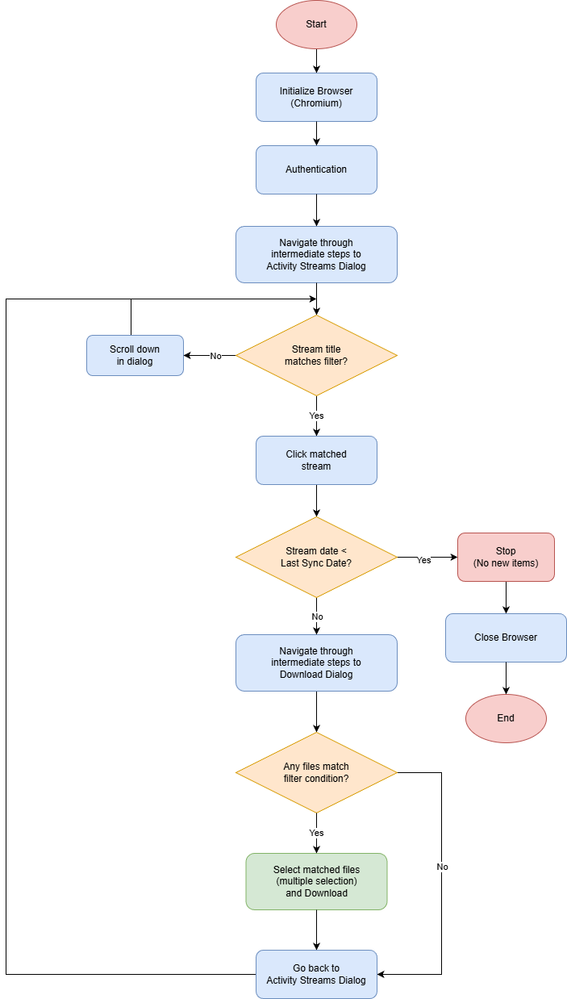
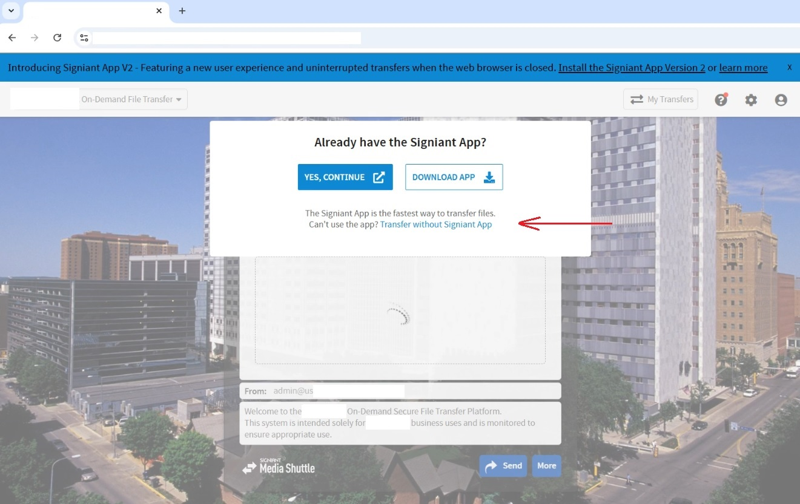
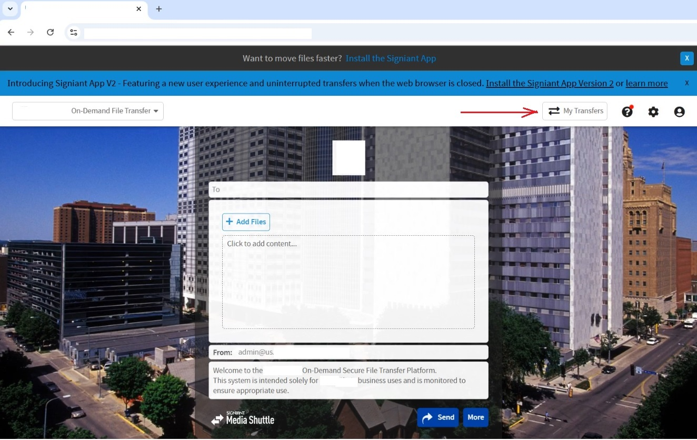
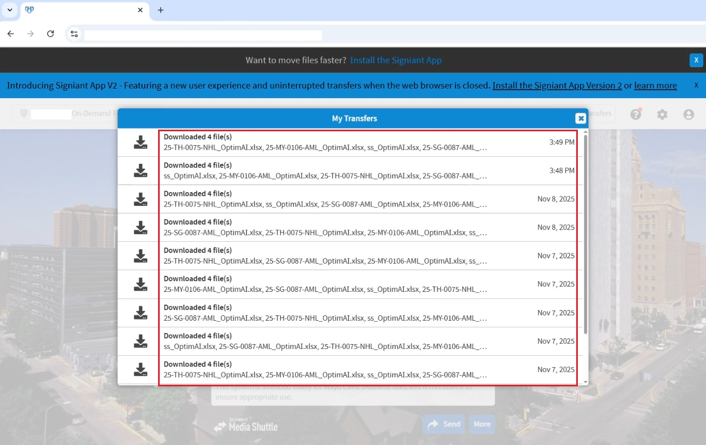
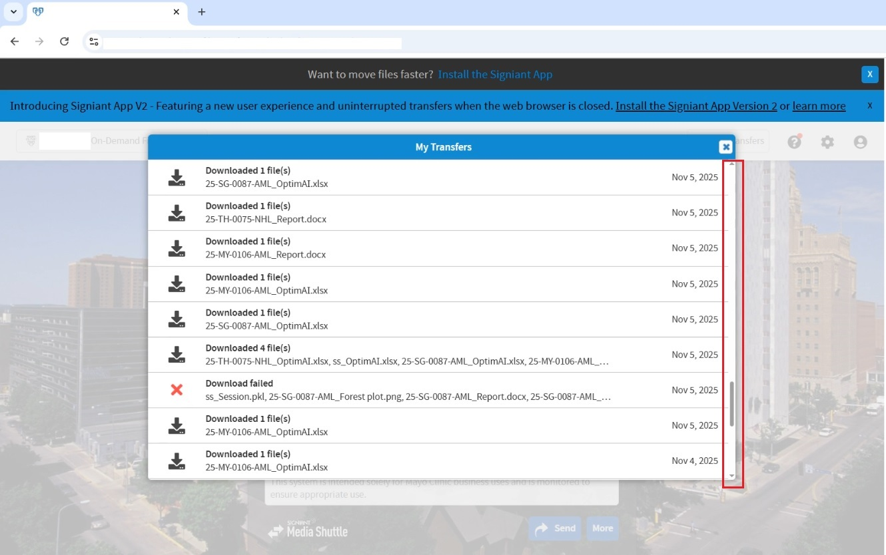
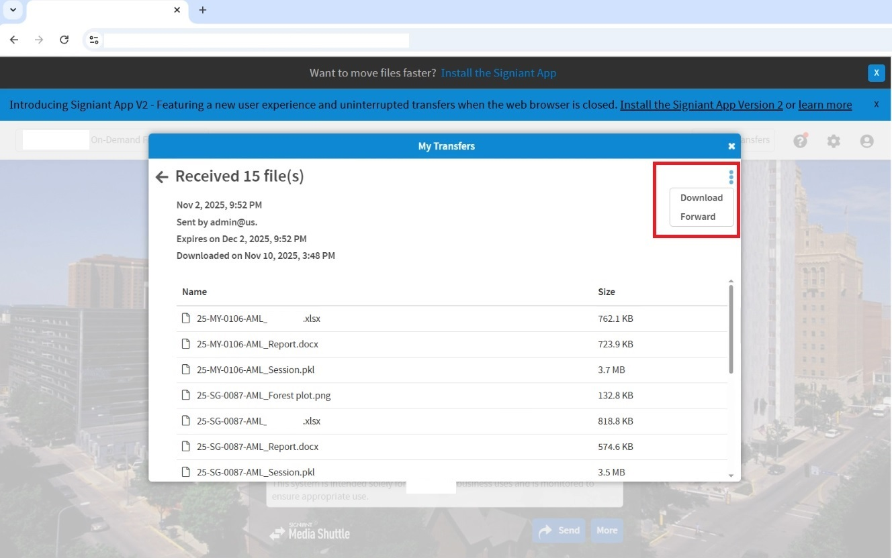
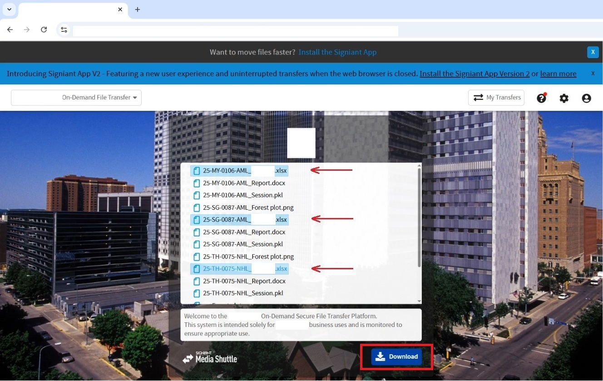
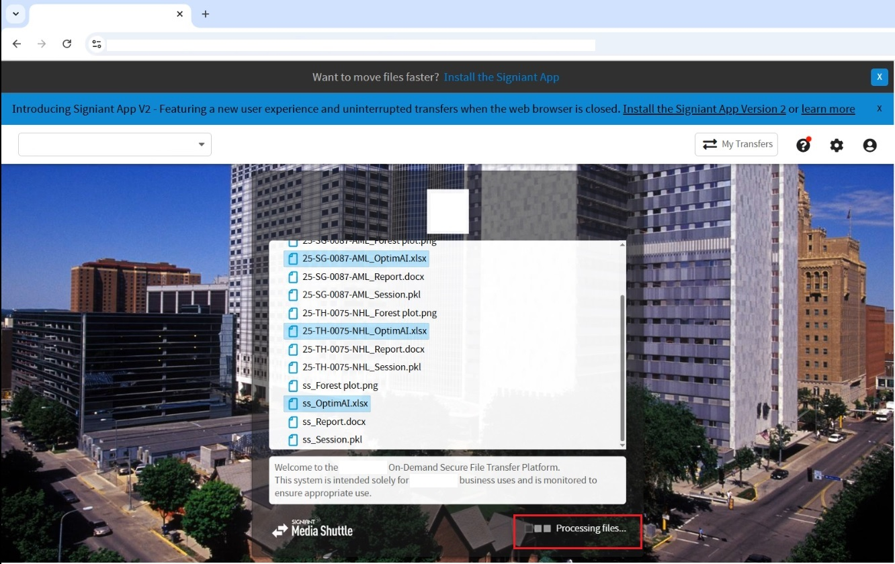
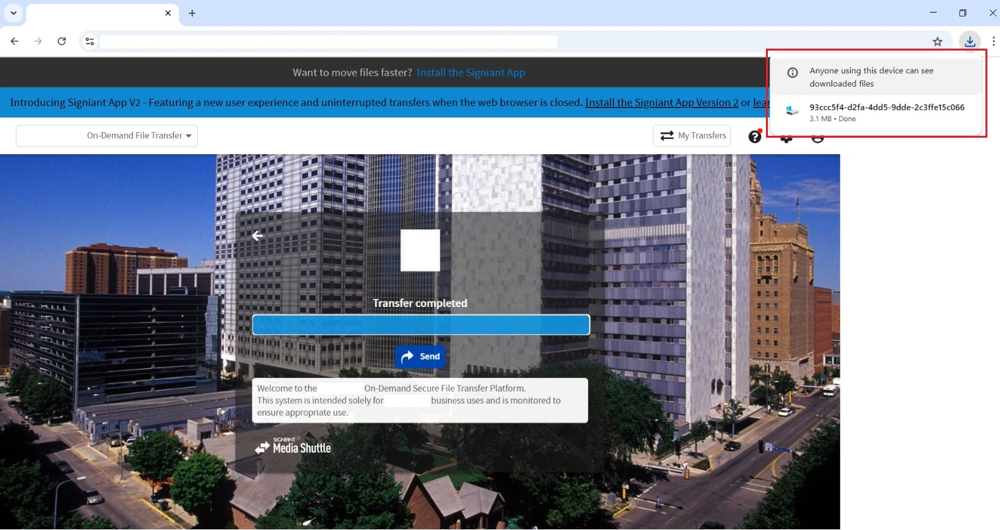
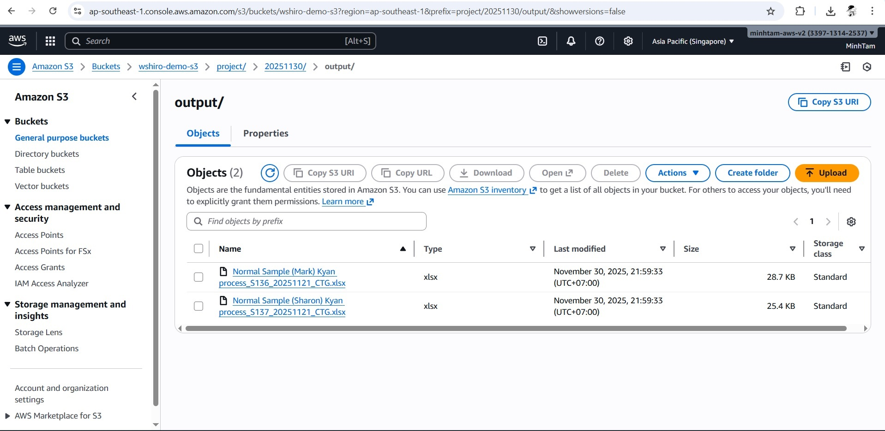

# Browser Automation - File Downloader & Uploader

An automated file downloader and uploader built with NestJS and Playwright that downloads files from based on custom filtering and uploads to AWS S3 bucket.

## Features

- **Automated Browser Control**: Uses Playwright to automate file downloads
- **Custom Filtering**: Downloads only files matched the filtered conditions
- **ZIP Extraction**: Automatically extracts downloaded ZIP files and processes contents
- **Single File Support**: Handles both ZIP archives and individual file downloads
- **Error Handling**: Built-in retry logic, error screenshots, and comprehensive logging
- **Cross-Platform**: Uses OS temp directories for downloads, ensuring compatibility across systems
- **AWS S3 Integration**: Automatically uploads downloaded files to S3 with organized folder structure
- **Batch Upload**: Processes multiple files efficiently with detailed success/failure reporting

## Tech Stack

- **NestJS** Backend framework with dependency injection
- **Playwright** - Browser automation for file downloads
- **TypeScript** - Type-safe development
- **adm-zip** - ZIP file extraction
- **Node.js fs/promises** - Async file operations
- **AWS SDK** - S3 client for cloud storage

## Project Structure

```
├── utils/
│   ├── media-shuttle.service.ts      # Main automation service
│   ├── browser-downloader.service.ts  # Download orchestration
│   └── S3-uploader.service.ts         # S3 upload service
├── interfaces/
│   ├── file-downloader.interface.ts   # Download interfaces
│   └── file-uploader.interface.ts     # Upload interfaces
├── main.ts                            # Application entry point
├── app.module.ts                      # NestJS module configuration
├── media-shuttle.config.ts            # Media Shuttle configuration
└── s3.config.ts                       # AWS S3 configuration
```

## Installation

```bash
npm install
```

## Configuration

Create a `config.env` file in the root directory:

```env
MEDIA_SHUTTLE_URL=your_media_shuttle_url
MEDIA_SHUTTLE_USERNAME=your_username
MEDIA_SHUTTLE_PASSWORD=your_password
MEDIA_SHUTTLE_RECIPIENT_EMAIL=your_email@example.com
MEDIA_SHUTTLE_TIMEOUT=30000
MEDIA_SHUTTLE_HEADLESS=false
MEDIA_SHUTTLE_MAX_RETRIES=3
MEDIA_SHUTTLE_SCREENSHOT_ON_ERROR=true

S3_BUCKET_NAME=your_s3_bucket
S3_REGION=your_region
S3_ACCESS_KEY_ID=your_access_key
S3_SECRET_ACCESS_KEY=your-seckey_key
```

## Usage

```bash

# Run the application
npx ts-node main.ts
```

## Workflow Diagram



## How It Works & screenshots

1. **Browser Initialization**: Launches Chromium browser with custom configuration
2. **Authentication**: Logs into the site using provided credentials


3. **Activity Navigation**: Navigates through intermediate steps to access file activities





4. **Activity Streams**: Scrolls down and filters activities based on pre-defined conditions







5. **File Selection**: Selects files that match conditions



6. **File Downloading**: Processes to download ZIP files or a single file





7. **Data Return**: Returns file metadata and buffer data for processing

8. **S3 Upload**: Uploads processed files to AWS S3 bucket



## AWS S3 Setup

1. **Create S3 bucket** in AWS Console
2. **Create IAM user** with S3 permissions
3. **Attach policy** to IAM user:
   ```json
   {
     "Version": "2012-10-17",
     "Statement": [
       {
         "Effect": "Allow",
         "Action": ["s3:PutObject", "s3:GetObject"],
         "Resource": "arn:aws:s3:::your-bucket-name/*"
       }
     ]
   }
   ```
4. Generate access keys for the IAM user
5. Add credentials to config.env

## Impact

Automates the download of hundreds of files daily, eliminating hours of manual work and reducing human error in file transfers.

## License

ISC
